# UI 기능 명세

구매자 페이지와 관리자 페이지를 별도로 나누어서 설계하였습니다.

# 구매자 UI 기능 명세

## 1. 전체 메뉴 페이지

### 1.1 화면 이름

Menu Page

### 1.2 기능

| 기능                      | 사용자 행동                                  | 조건 / 예외                   | 처리 로직                                                                                                                            | 결과                            |
| ------------------------- | -------------------------------------------- | ----------------------------- | ------------------------------------------------------------------------------------------------------------------------------------ | ------------------------------- |
| 메뉴 목록 조회            | 페이지 진입                                  | 없음                          | 1. 서버에서 메뉴 목록 API 호출 (`GET /api/menu`) 2. 응답 데이터를 상태에 저장 3. UI에 카테고리별(음식, 음료)로 분류하여 렌더링 | 음식·음료 메뉴 카드 리스트 표시 |
| 음식 상세 정보            | 메뉴 카드 클릭                               | 품절 상태가 아님              | 선택한 메뉴의 세부 정보 팝업창 띄우기 & 배경 회색                                                                                    | 음식 팝업창 & 배경 회색         |
| 주문하기 or 장바구니 버튼 | 하단 "주문하기" or 장바구니 아이콘 버튼 클릭 | 장바구니에 최소 1개 이상 담김 | 장바구니 페이지로 라우팅(`/order`)                                                                                                   | 장바구니 페이지로 이동          |
| 주문 내역 조회            | 좌측 상단 "영수증" 아이콘 클릭               | 장바구니 비어 있음            | 주문 내역 페이지 이동                                                                                                                | 주문 내역 페이지 이동           |
| 주문 불가 안내            | 하단 "주문하기" 버튼 클릭                    | 장바구니 비어 있음            | 토스트 메시지 표시("주문할 메뉴를 선택해주세요.")                                                                                    | 현재 페이지 유지                |

## 2. 음식 팝업창

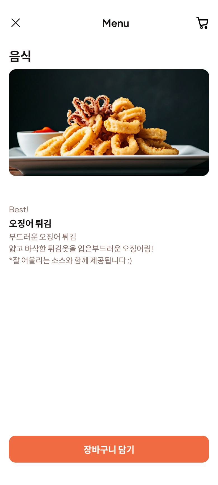

### 1.1 화면 이름

음식 상세 정보 팝업

### 1.2 기능

| 기능             | 사용자 행동                         | 조건 / 예외    | 처리 로직                                                                                     | 결과                                    |
| ---------------- | ----------------------------------- | -------------- | --------------------------------------------------------------------------------------------- | --------------------------------------- |
| 메뉴 정보 표시   | 팝업 진입 시                        | 메뉴 ID 유효   | 1. API 호출(`GET /api/menu/:id`)로 메뉴 상세 정보 가져오기 2. 이미지·이름·설명·가격 렌더링 | 화면에 해당 메뉴의 상세정보 표시        |
| 팝업 닫기        | 상단 좌측 닫기(X) or 팝업 외부 클릭 | 없음           | 팝업 닫기 이벤트 실행                                                                         | 이전 페이지(메뉴 목록)로 복귀           |
| 장바구니 담기    | 하단 "장바구니 담기" 버튼 클릭      | 품절 상태 아님 | 1. 선택 메뉴를 장바구니 상태에 추가 (이미 존재 시 수량 +1) 2. 장바구니 상태 전역 저장   | 장바구니 아이콘에 수량 반영 & 팝업 닫힘 |
| 데이터 로드 실패 | 팝업 진입 시                        | API 호출 실패  | 오류 메시지 표시 & 닫기 버튼 노출                                                             | 이전 화면 유지                          |

## 3. 장바구니

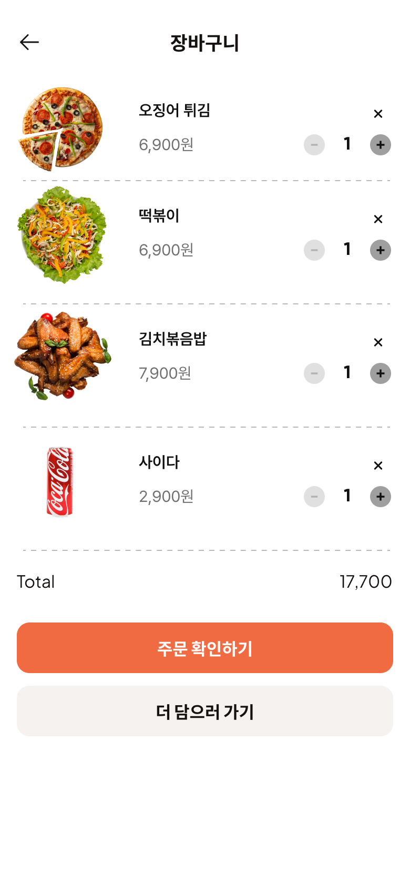

### 3.1 화면 이름

장바구니

### 3.2 기능

| 기능                   | 사용자 행동                     | 조건 / 예외            | 처리 로직                                                          | 결과                           |
| ---------------------- | ------------------------------- | ---------------------- | ------------------------------------------------------------------ | ------------------------------ |
| 이전 페이지로 이동     | 상단 좌측 화살표 클릭           | 없음                   | 이전 페이지로 라우팅                                               | 이전 화면으로 이동             |
| 수량 감소              | 메뉴 행의 `-` 버튼 클릭         | 현재 수량 > 1          | 해당 메뉴의 수량 -1 총액(Total) 재계산                          | 수량 변경 및 총액 갱신         |
| 수량 증가              | 메뉴 행의 `+` 버튼 클릭         | 재고 초과 불가         | 해당 메뉴의 수량 +1 총액(Total) 재계산                          | 수량 변경 및 총액 갱신         |
| 메뉴 삭제              | 메뉴 행의 `×` 버튼 클릭         | 없음                   | 해당 메뉴를 장바구니 상태에서 제거 총액(Total) 재계산           | 해당 메뉴 행 삭제 및 총액 갱신 |
| 총액 표시              | 장바구니 데이터 변경 시         | 없음                   | 모든 메뉴의 (가격 × 수량) 합산                                     | 화면 하단 Total 영역에 표시    |
| 주문 확인              | 하단 "주문 확인하기" 버튼 클릭  | 장바구니 비어있지 않음 | 주문 확인 페이지로 라우팅(`/order/confirm`)                        | 주문 확인 페이지 이동          |
| 더 담으러 가기         | 하단 "더 담으러 가기" 버튼 클릭 | 없음                   | 메뉴 목록 페이지로 라우팅(`/menu`)                                 | 메뉴 목록 페이지 이동          |
| 장바구니 비어있음 표시 | 장바구니 수량 = 0               | 없음                   | "장바구니가 비어있습니다" 메시지 표시 & 메뉴 담기 유도 버튼 활성화 | 빈 장바구니 UI 표시            |

## 4. 주문 상세

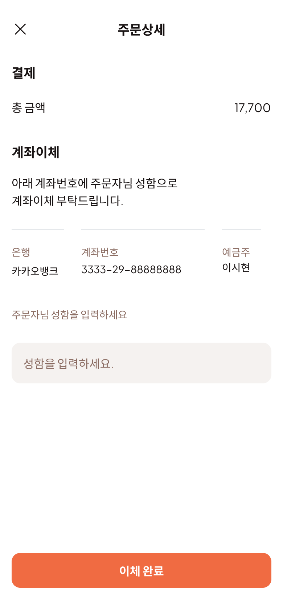

| 기능                | 사용자 행동                 | 조건 / 예외                 | 처리 로직                                                                                                                           | 결과                                               |
| ------------------- | --------------------------- | --------------------------- | ----------------------------------------------------------------------------------------------------------------------------------- | -------------------------------------------------- |
| 페이지 닫기         | 상단 좌측 닫기(X) 버튼 클릭 | 없음                        | 팝업/페이지 닫기 이벤트 실행                                                                                                        | 이전 화면(장바구니 또는 주문 확인 페이지)으로 이동 |
| 총 금액 표시        | 페이지 진입                 | 주문 데이터 존재            | 주문 데이터에서 총 금액 값 가져와 화면에 표시                                                                                       | 상단 "총 금액" 영역에 표시                         |
| 계좌 정보 표시      | 페이지 진입                 | 주문 데이터 존재            | 결제용 계좌 정보(은행명, 계좌번호, 예금주) 표시                                                                                     | 사용자에게 계좌이체 정보 안내                      |
| 성함 입력           | 성함 입력란 포커스          | 없음                        | 입력값을 상태에 저장                                                                                                                | 입력된 성함이 이체 완료 처리 시 사용됨             |
| 이체 완료           | 하단 "이체 완료" 버튼 클릭  | 성함 입력값이 비어있지 않음 | 1. 입력값 유효성 검사 2. 주문 상태 API 호출(`POST /api/orders/confirm`)로 결제 확인 요청 3. 성공 시 결제 확인중 페이지로 이동 | 결제 확인 중 페이지로 라우팅                       |
| 입력값 누락 시 경고 | 하단 "이체 완료" 버튼 클릭  | 성함 입력란 비어 있음       | 경고 메시지 표시("성함을 입력해주세요.")                                                                                            | 현재 페이지 유지                                   |

## 5. 결제 승인 대기

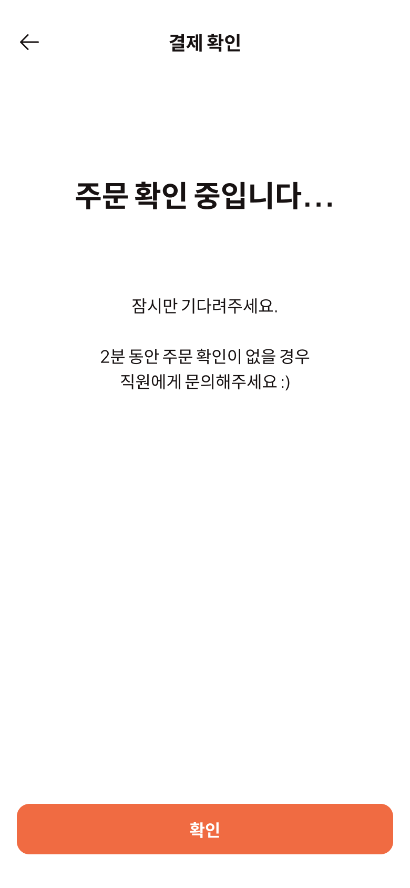

### 5.1 페이지 이름

결제 확인(대기) 페이지

### 5.2 기능

| 기능           | 사용자 행동          | 조건 / 예외              | 처리 로직                                                                                | 결과                         |
| -------------- | -------------------- | ------------------------ | ---------------------------------------------------------------------------------------- | ---------------------------- |
| 이전으로       | 좌상단 ← 아이콘 클릭 | 없음                     | 히스토리 뒤로 가기                                                                       | 이전 화면으로 이동           |
| 상태 대기 시작 | 페이지 진입          | `orderId` 존재           | 1) 상태 리스너 시작(SSE/WebSocket) **혹은** 폴링 시작(3\~5초 간격)  2) 로딩 문구 표시 | “주문 확인 중입니다…” 표시   |
| 자동 완료 이동 | (사용자 행동 없음)   | 서버에서 `APPROVED` 수신 | `/order/complete/:orderId` 로 라우팅                                                     | 결제 확인 완료 페이지로 이동 |
| 확인 버튼      | 하단 “확인” 클릭     | 없음                     | 홈(/menu)로 라우팅                                                                       | 메인(메뉴)로 이동            |
| 리소스 정리    | 페이지 이탈          | 없음                     | SSE/WS 연결 해제, 폴링 타이머 해제                                                       | 누수 방지                    |

### 5.3 추가 고려사항

만약에 네트워크 장애가 생겨서 요청이 안가는 문제가 있을 수 있다.

## 6. 주문 완료

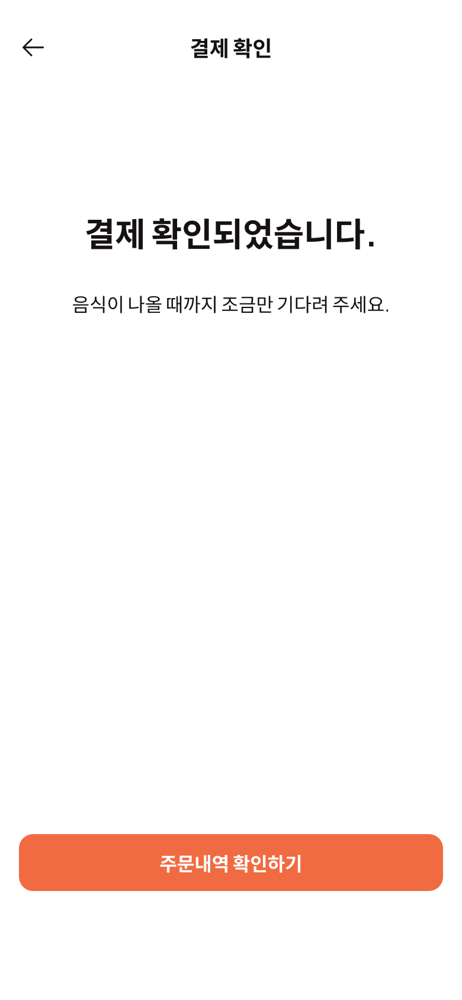

### 6.1 페이지 이름

주문 완료 페이지

### 6.2 기능

| 기능              | 사용자 행동          | 조건 / 예외 | 처리 로직                    | 결과                                      |
| ----------------- | -------------------- | ----------- | ---------------------------- | ----------------------------------------- |
| 이전으로          | 좌상단 ← 아이콘 클릭 | 없음        | 히스토리 뒤로 가기           | 이전 화면(결제 확인 대기 페이지)으로 이동 |
| 주문내역 확인하기 | 하단 버튼 클릭       | 없음        | `/orders/:orderId` 로 라우팅 | 주문 상세/내역 페이지 이동                |

## 7. 주문 내역

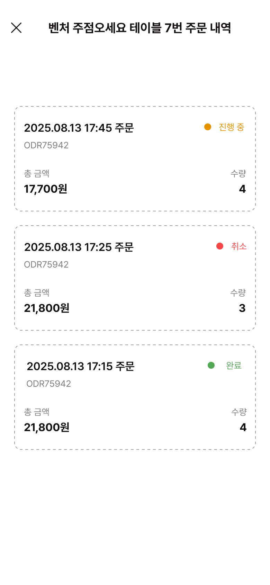

### 7.1 페이지 이름

주문 내역

### 7.2 기능

- 좌상단 x 클릭 시 : 메인 메뉴 페이지로 이동
- 주문 내역 정보 렌더링 : 서버에서 API로 데이터 가져오기
- 상태에 따라서

---

# 관리자 UI 기능 명세서

## 0. 공통 UI

### 0.1 헤더

- 페이지별로 title 변경

### 0.2 사이드바

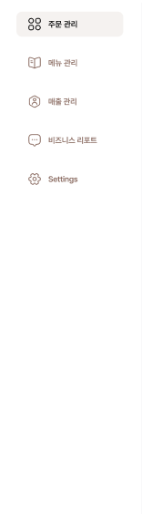

- 네이게이터 기능 (setting 제외)

## 1. 주문 관리

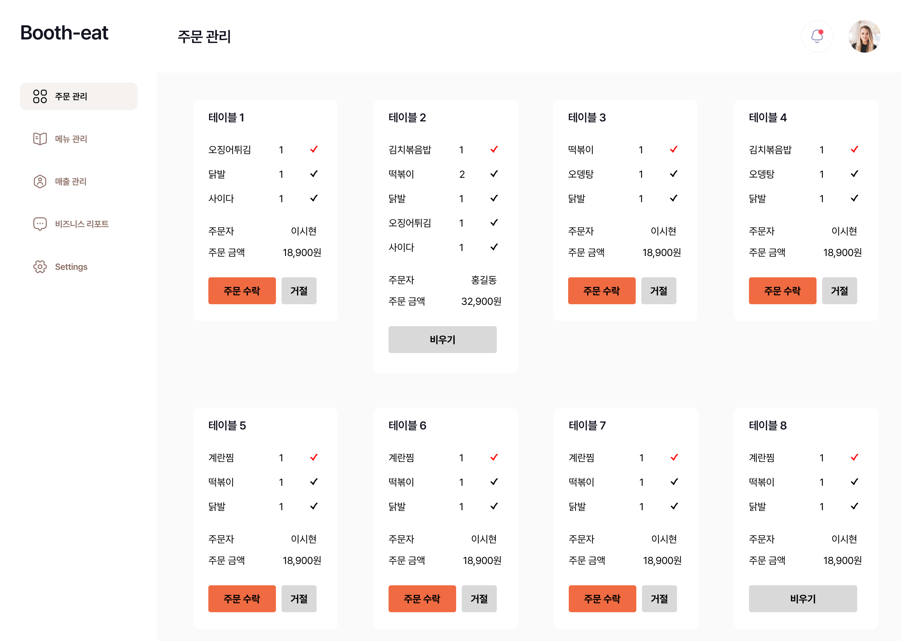

### 1.1 화면 이름

주문 관리

### 1.2 기능
- 서버에서 API로 주문 데이터 받아와서 렌더링
- 주문 카드
  - API로 주문 정보 받아오기 (boothId에 해당하는 주문정보)
  - table정보의 active 상태를 통해서 테이블이 비워졌는지 확인
    - 비워졌다면 "테이블이 비어있다고 텍스트 작성"
    - active 상태라면 아래 수행
  - 받아온 table 정보 카드에 렌더링
  - 주문 상태에 따라 다르게 표시
    - 주문 상태가 PENDING 인 경우
      - 주문 수락/거절 버튼 생성 -> API 로 주문 수락/거절 데이터 전달
    - 주문 상태가 ACCEPTED 인 경우
      - 각각 메뉴에 대해서 체크 표시 생성 (완료 여부 확인할 수 있도록 하기)
        (중요한 정보이므로 서버에 저장시키면 더 좋음)
      - 비우기 버튼 생성 -> alert "정말로 비우시겠습니까?" -> API로 비워졌다는 정보 전달
    - 주문 상태가 APPROVED 상태인 경우 -> 비우기 버튼으로 변경
  - 카드의 우측 상단에 영수증 표시 클릭시 -> 상세보기 팝업창 띄우기

| 기능                 | 사용자 행동                   | 조건 / 예외                                        | 처리 로직                                                                                                                         | 결과               |
| ------------------ | ------------------------ | ---------------------------------------------- | ----------------------------------------------------------------------------------------------------------------------------- | ---------------- |
| 주문 데이터 조회/렌더링      | 페이지 진입                   | `boothId` 유효                                   | 1) `GET /api/booths/{boothId}/orders` 호출 2) redux `orders.list`에 저장 3) 테이블 번호 기준 그리드 렌더링                                | 주문 카드 목록 표시      |
| 테이블 비어있음 표시        | 카드 표시                    | `table.active === false`                       | 카드 본문을 “현재 테이블이 비어있습니다.” 텍스트로 대체(버튼/체크/액션 숨김)                                                                                 | 빈 테이블 텍스트 노출     |
| 테이블 활성 주문 렌더링      | 카드 표시                    | `table.active === true`                        | 주문자/금액/항목/시간/상태 배지 UI 바인딩                                                                                                     | 활성 주문 카드 표시      |
| 주문 상태 분기           | 카드 로드                    | `status ∈ {PENDING, ACCEPTED, DONE, REJECTED}` | 상태별 액션/체크/버튼 토글                                                                                                               | 상태별 다른 UI        |
| 주문 수락              | `PENDING` 카드의 “주문 수락” 클릭 | 이미 처리 시 비활성/경고                                 | `POST /api/orders/{id}/accept` → 성공 시 리스트 내 해당 주문을 `ACCEPTED`로 갱신                                                             | 처리 상태로 전환        |
| 주문 거절              | `PENDING` 카드의 “거절” 클릭    | (선택) 사유 입력 없음 가능                               | `POST /api/orders/{id}/reject` → `REJECTED`로 갱신                                                                               | 거절 상태 표시         |
| 항목 완료 체크(클라이언트 저장) | `ACCEPTED` 카드에서 항목 체크/해제 | 서버 저장 안 함                                      | **API 전송 없음**. redux `orders.itemDone[orderId][index]=true/false` 갱신 → 카드 즉시 반영. 페이지 이탈해도 초기화되면 안됨. localstorage에 저장도 생각할 것                  | 체크 UI만 로컬 반영     |
| 테이블 비우기(주문 완료)     | `ACCEPTED` 카드의 “비우기” 클릭  | 확인 필요                                          | `alert("정말로 비우시겠습니까?")` 확인 시 `POST /api/orders/{id}/clear` 호출 → 성공 시 해당 주문 `DONE` 처리 + `table.active=false`로 갱신하여 “비어있습니다” 표시 | 완료 처리 & 빈 테이블 표기 |
| 상세보기 팝업            | 카드 우측 상단 “영수증/상세” 아이콘 클릭 | 데이터 로딩 중일 수 있음                                 | 해당 주문 id에 대한 팝업 띄우기                                     | 상세 팝업 표시         |
| 오류 처리              | 각 API 실패                 | 네트워크/서버 오류                                     | 에러 토스트, 실패한 액션 롤백(수락/거절/비우기)                                                                                                  | 사용자에게 오류 안내      |

## 2. 주문 세부 정보 팝업
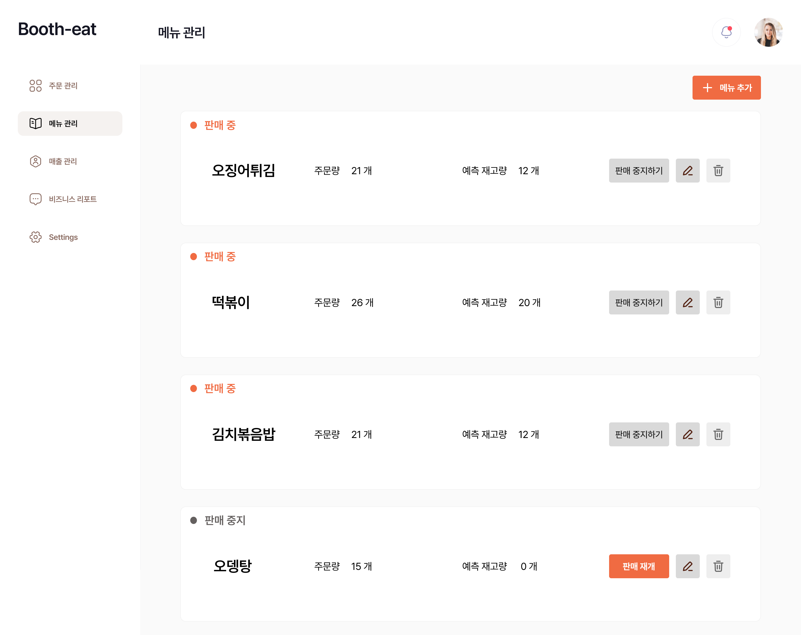

### 2.1 화면 이름
주문 세부 정보

### 2.2 기능
- 팝업 닫기 기능
  - 헤더에 테이블 번호와 닫기 버튼 생성
  - 팝업 외부 클릭시 팝업 닫힘
- 각 카드 별 (booth, 테이블번호에 해당하는 주문 데이터 전체 가져오기)
  - order 상태
    - 진행중인 경우 : 테이블 비우기 버튼 활성화 (버튼 클릭시에 처리는 이전 주문 관리와 동일. 주문 관리에서 사용한 함수 그대로 사용하면 됨)
    - 완료된 경우 : 아래에 흐리게 완료 표시
  - 팝업 내부의 스크롤로 전체 데이터 가져와서 표시

| 기능              | 사용자 행동             | 조건 / 예외           | 처리 로직                                                                                          | 결과                  |
| --------------- | ------------------ | ----------------- | ---------------------------------------------------------------------------------------------- | ------------------- |
| 팝업 열기           | 카드 아이콘 클릭          | 없음                | `openOrderDetail({boothId, tableNo})` → 데이터 없으면 fetch                                          | 모달 오픈 & 스켈레톤/리스트 표시 |
| 팝업 닫기           | X 클릭 / 백드롭 / Esc   | 폼 편집 중 경고(선택)     | `closeModal()`                                                                                 | 모달 닫힘               |
| 진행 주문 “테이블 비우기” | 카드의 **테이블 비우기** 클릭 | `status=ACCEPTED` | `confirm()` → `POST /api/orders/{id}/clear` → 성공 시 모달/리스트 둘 다 갱신(`DONE`, `table.active=false`) | 카드에 “완료/비어있음” 반영    |
| 완료 주문 표시        | 완료된 주문             | `status=DONE`     | 버튼 비활성, 하단 **완료** 그레이 표시                                                                       | 읽기 전용               |
| 항목 체크(로컬)       | 체크 토글              | 서버 저장 안 함         | redux에 `itemDone[orderId][index] = true/false` 저장(주문 관리와 동일 키)                                 | 카드 내 체크 UI 즉시 반영    |
| 오류 처리           | API 실패             | 네트워크/권한           | 토스트 에러, 필요 시 롤백                                                                                | 사용자 안내              |

## 3. 메뉴 관리

### 3.1 화면 이름
메뉴 관리

### 3.2 기능
- 메뉴 렌더링
  - 부스의 전체 메뉴 API로 가져오기
  - available 에 따라서 판매중, 판매 중지 표시. 판매 중인 경우 '판매 중지하기'버튼, 판매 중지인 경우 '판매 재개' 버튼 표시
- 부스의 메뉴별 주문량 API로 가져와서 주문량에 표시하기.
- 예측 재고량은 생략
- 메뉴 수정(연필) 버튼 누를 시, 해당 메뉴 수정할 수 있도록 추가. 수정한 이후 API로 전송기능
- 메뉴 삭제(휴지통) 버튼 누를 시, '${name}을 삭제하시겠습니까?'하고 삭제 요청
- 메뉴 추가 버튼 누르르 시, 입력창 나옴. 그리고 반영하면 처리됨. 

## 4. 매출 관리
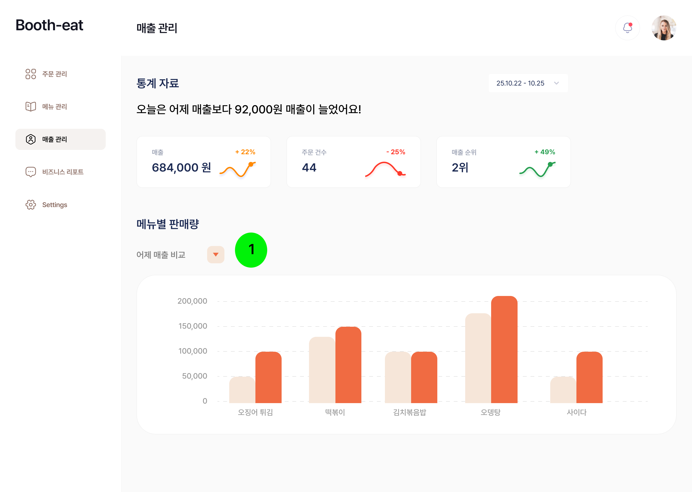

### 4.1 화면 이름

### 4.2 기능
- 해당 부스의 당일 통계 데이터 API로 가져오기
  - 매출, 주문 건수, 매출순위
  - 메뉴별 매출, 메뉴별 판매량

## 5. 비즈니스 리포트
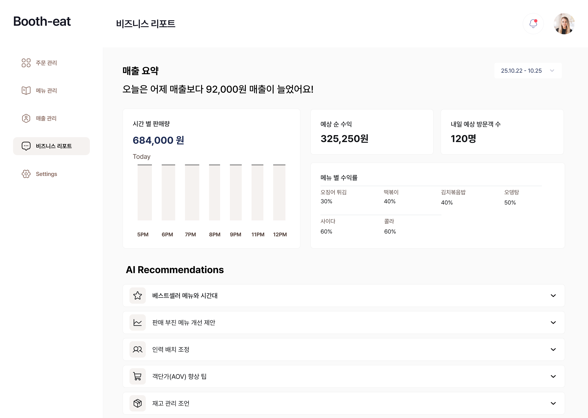